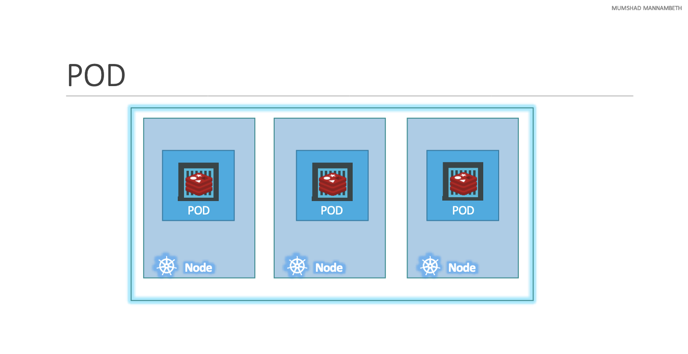
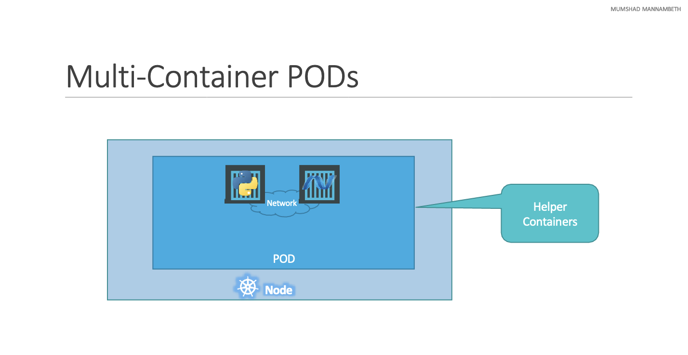

# Kubernetes Concepts

## What are pods?

Assume that the following have been already implemented:

- Application developed, built into Docker image and pushed into a repository
(so Kubernetes can pull it down).
- Kubernetes cluster has already been set up and is working (could be a single
node setup or a multinode setup) with all the services in running state.

As we discussed before, with Kubernetes our ultimate goal is to deploy our
application in the form containers on a set of machines that are configured as
worker nodes in a cluster. However Kubernetes does not deploy containers
directly on the worker nodes, containers are encapsulated into Kubernetes
objects known as **PODs**.

A **POD** is a **SINGLE INSTANCE** of an application. A POD is the smallest object
you can create in Kubernetes.

- You need to scale up your app? Add more PODs with your application!  
- You need to scale down your app? Remove PODs!  
- Node is running our of capacity? Add more nodes!

### Multi-container PODs

Are we restricted of having a single container in a single POD? **NO!**

A single POD can have multiple containers except for the fact that they are
usually not multiple containers of the same kind. Sometimes you might have an
scenario where you have a helper container that might be doing some kind of
supporting task for our web application, such as processing a user, processing a
file uploaded by the user, etc. And you want these helper containers to live
alongside your application container. In that case, you can have both these
containers part of the same POD, so that when a new application container is
created, the helper is also created, and when it dies, the helper also dies
since they are part of the same POD. The two containers can also communicate
with each other directly by referring each other as local hosts **since they
share the same network space**, plus **they can share the same storage space as
well**.

