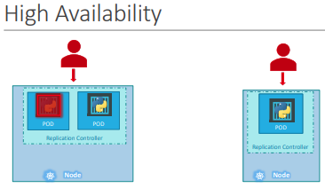
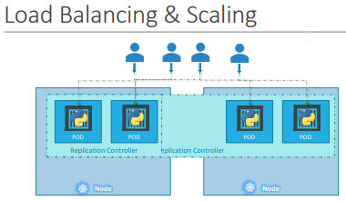
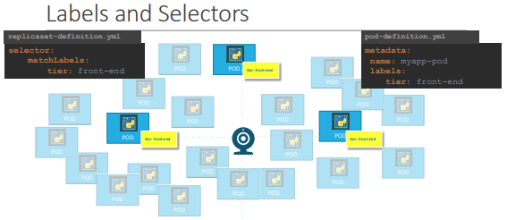

# Replication Controllers And Replica Sets

## What are they?

Let's say we have one single POD running our application...  
What if for some reason our application crashes and the POD fails?  
Uses will no longer be able to access our application!  

To prevent users from losing access we would like to have more than 1 POD running at the same time, that way if one fails we still have our application running on the other one.

The replication controller helps us run multiple instances of a single POD in the Kubernetes cluster thus providing high availability.



Does this mean that I can't use a replication controller if I use a single POD? **NO!**

Even if you have a single POD, the replication controller can help by automatically bringing up a new POD when the existing one fails.

Thus the **replication controller** ensures that the specified number of PODs are running at all times, even if it's just one or one hundred.

Another reason we need the replication controller is to create multiple PODs to share the load across them. For example, let's say we have a single POD serving a set of users, when the number of users increase we deploy additional POD to balance across the two PODs, if the demand further increases we were to run out of resources on the first node, we could deploy additional parts across the other nodes in the cluster.  
The replication controller spans across multiple nodes in the cluster, it helps us balance the load across multiple paths or different nodes as well as scale our application when the demand increases.



It's important to know that there are two similar terms: **Replication Controller v.s. Replica Set**.
Both have the same purpose, but they are not the same!

**Replication Controller** is the older technology that is being replaced by **Replica Set**.
There are minor differences in the way each works and we will look at that in a bit.

This is how you create a replication controller using YAML:  
File `rc-definition.yml`
```yaml
apiVersion: v1
kind: ReplicationController
metadata:
  name: myapp-rc
  labels:
    app: myapp
    type: front-end
spec:
  template:
    # Here you put a POD YAML definition but only the metadata and the spec
    metadata:
      name: myapp-pod
      labels:
        app: myapp
        type: front-end
    spec:
      containers:
        - name: nginx-container
          image: nginx
  replicas: 3
```

To create this replication controller just run:
```
kubectl create -f rc-definition.yml
```

Get the replication controllers:
```
kubectl get replicationcontroller
```

Do you want to see what PODs were created by the replication controller? Run:
```
kubectl get pods
```
After running this command note that some POD names are starting with the name of the replication controller:
```
NAME              READY
myapp-rc-41vk9    ... 
myapp-rc-mc2mf    ... 
myapp-rc-px9pz    ... 
```

Now let's take a look at the replica set, just take a look:

File `replicaset-definition.yml`
```yaml
apiVersion: apps/v1
kind: ReplicaSet
metadata:
  name: myapp-replicaset
  labels:
    app: myapp
    type: front-end
spec:
  template:
    metadata:
      name: myapp-prod
      labels:
        app: myapp
        type: front-end
    spec:
      containers:
        - name: nginx-container
          image: nginx
  replicas: 3
  selector:   # <- The selector section helps the replica set identify what PODs fall under it.
    matchLabels:
      type: front-end
```

Why would you have to specify what PODs fall under it if you have provided the contents of the POD definition file itself in the template?  
It's because replica set can also manage parts that were not created as part of the replica set creation, for example, there were PODs created before the creation of the replica set that match labels specified by the selector, the replica set will also take those PODs into consideration when creating the replicas.

**The selector is one of the major differences between replication controller and replica set!**

- The selector **IS NOT A REQUIRED FIELD** in case of a **replication contoller** but is still available, when you skip it, it assumes to be the same as the labels provided in the POD definition file.  
- The selector **IS A REQUIRED FIELD** in case of a **replica set**, also the replica set selector provides many other options for matching labels that were not available in the replication controller.

To create a replica set just use the following command:
```
kubectl create -f replicaset-definition.yml
```
To see the create replica set just use:
```
kubectl get replicaset
```

So what is a replica set?

It's a process that monitors the PODs, if there is a failing POD the replica set just deploys a new one to supply the failed one. How does it know what PODs to monitor? It uses the labels of the PODs.



The replica set needs the definition of the POD because in case it needs to create a new POD to supply a failed one.

## How do I scale?

Let's say you want 
