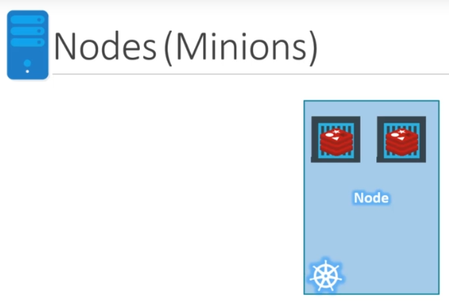

# Kubernetes Overview

## Container v.s. Image

An **image** is a package or a template, it's used to create one or more containers.

**Containers** are running instances of images thatt are isolated and have their own environments and set of processes.

## Container Orchestration

What if the application relies on other containes such as databases or messaging services? Or other backend services? What if the number of users increase and you need to scale your application? How do you scale down when the charge decreases?

To enable this functionalities you need **an underlilying platform with a set of resources and capabilities, the platform needs to orchestrate the connectivity between containers and automatically scale up or down based on the load.**

Automatically deploying and managing containers is known as Container Orchestration.

Some tools to orchestrate:

- Docker Swarm
- Kubernetes
- MESOS

Kubernetes advantages:

- HA.
- Hardware failures do not bring the application down because we have multiple instances of your application running on different nodes.
- User traffic is load balanced accross the various containers.
- When demand increases, deploy more instances of the application seamlessly and within a matter of seconds, we have the ability to do that at service level.
- When we run out of hardware resources scale the number of underlying nodes up or down without having to take down the application.
- All this is done by a set of declarative object configuration files.

**So what is Kubernetes?** It's a container orchestration technology used to orchestrate the deployment and management of hundreds and thousands of containers in a clustered environment.

## Kubernetes architecture

### Node

A node is a machine, physical or virtual on which Kubernetes is installed, a node is a worker machine and that is where containers will be launched by Kubernetes. They were called minions in the past. What if the node on which your application is running fails? The application goes down, so you need more than 1 node.

### Cluster

A cluster is a set of nodes grouped togheter, so if a node fails you have your application still accessible from the other nodes. Moreover having multiple nodes helps sharing the load as well.

### Master

Who is reponsible for managing the cluster? Where is the information about members of the cluster stored? How are the nodes monitored? When a node fails, how do you move the workload of the field node to another worker node? There's where the master comes in, the master is another **node** with Kubernetes installed in it and is configured as a master. The master watches over the nodes in the cluster and is responsible for the actual orchestration of containers on the worker nodes.

### Components

When you install Kubernetes in a system you are actually installing the following components:

- An API server.
- `etcd` service.
- `kubelet` service.
- A container runtime.